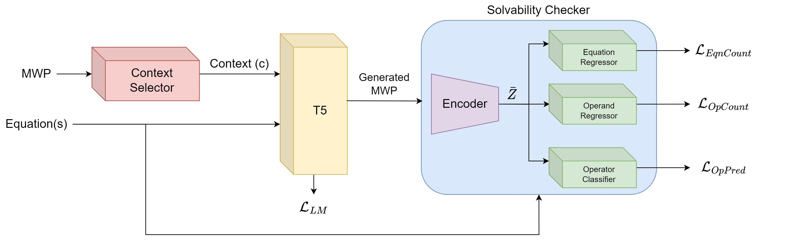

# MWP-T5: Fine-tuning with Numeracy for Math Word Problem Generation

This repository contains the code for the
paper [Fine-tuning with Numeracy for Math Word Problem Generation]() [[PDF]()] published at IEEE T4E 2023.



You can access our trained models [here](https://huggingface.co/mwpt5). If you would like to cite our work, please use
the following BiBTex entry:

```

```

# Installation

We recommend using `conda` with `Python 3.10` or higher. You can install the required packages with the following
commands:

```bash
conda create -n mwpt5 python=3.10
conda activate mwpt5
pip install -r requirements.txt
```

# Configuring the Dataset

The datasets used for the study have been included in the `./data` directory. You can find both
the original and the processed forms of the dataset used for training. If you would like to train MWP-T5 on your own
dataset, create a dataset with the following columns. Ensure to mask the numbers in the question and combine multiple
equations with the `<BRG>` token.

| Question                                                                                                                      | Equation                              | Answer    | Numbers  |
|-------------------------------------------------------------------------------------------------------------------------------|---------------------------------------|-----------|----------|
| Mary is baking a cake. The recipe wants N_00 cups of flour. She already put in N_01 cups. How many cups does she need to add? | N_00 - N_01                           | 6.0       | 8.0 2.0  |
| The difference between two numbers is N_00. Find the numbers if their sum is N_01.                                            | v0 + v1 = N_01 \<BRG\> v0 - v1 = N_00 | 27.5 18.5 | 9.0 46.0 |

# Training

The source code and related dependencies have been created using an object-oriented approach,
thus allowing you to dynamically integrate and remove various components of the model.
In the following, we will explain how to use the code to train and evaluate the model.

## Stage 1 - Fine-tuning the Solvability Checker

### Load the dataset

First, we need to load the dataset. We will use the `MAWPS` dataset for this example.

```python
from mwp.dataset import MWPDataset

dataset = MWPDataset()
dataset.load("data/processed/MAWPS.csv")
# If you would like to extend the dataset object, simply load another dataset
# dataset.load("data/processed/PEN.csv") 
dataset.shuffle()  # Shuffle the dataset
```

### Initialise the Solvability Checker

We need to initialise a new solvability checker. Ensure to set the `language_model` argument to `None` so that
the embeddings from the BERT model are trained.

```python
from mwp.model.core.solvability_checker import SolvabilityChecker

solvability_checker = SolvabilityChecker("invokerliang/MWP-BERT-en", device="cuda")
```

### Initialise the Trainer

Set up a new trainer with the desired learning rate. You can also configure other training parameters like the optimiser
and scheduler using keyword arguments. You can view `mwp.trainer.base.BaseTrainer` for more information.

```python
from mwp.trainer import SolvabilityCheckerTrainer

trainer = SolvabilityCheckerTrainer(solvability_checker, learning_rate=1e-5)
# You can also configure the optimiser and scheduler
# trainer = SolvabilityCheckerTrainer(model, learning_rate=1e-5, optimiser="sgd", scheduler="step")
```

### Train the Solvability Checker

We can now train the solvability checker. The `train()` method requires the model, dataset, number of epochs, batch size
and save directory to train. You can additionally pass other keyword arguments like hyperparameter values and even a
HuggingFaceHub token and username to automatically push the model to the HuggingFaceHub. You can
view `mwp.trainer.base.BaseTrainer` for more information.

```python
trainer.train(
    model=solvability_checker,  # The model to train
    dataset=dataset,  # The dataset to train on
    batch_size=4,  # The batch size
    epochs=20,  # The number of epochs to train
    save_dir="./models",  # The directory to save the model
    learning_rate=1e-5,  # The learning rate
    gamma=0.5,  # The hyperparameter value for gamma
    eta=2,  # The hyperparameter value for eta
    zeta=0.5,  # The hyperparameter value for zeta
    use_tensorboard=True,  # Whether to use tensorboard to log losses
    tensorboard_log_dir="./logs",  # The directory to store the tensorboard logs
    upload_model_to_hub=True,  # Whether to upload the entire model to the HuggingFaceHub
    save_every=1,  # The number of epochs to save the model
    save_latest=False,  # Whether to only save the latest model at the end of each epoch
    hub_model_name="new-solvability-checker",  # The name of the model on the HuggingFaceHub
    auth_token="",  # The HuggingFaceHub auth token
    hub_organization="MWP-T5"  # The HuggingFaceHub organization
)
```

You can also view the `src/train_solvability_checker.py` file for a complete example.

## Stage 2 - Fine-tuning the Language Model

### Load the dataset

The dataset can be loaded using the same steps covered [above](#load-the-dataset).

### Initialise the Context Selector

We need to initialise a new context selector to extract topic words from an input MWP. All the
implemented context selectors have been provided in `mwp.model.context_selector/`.

If you would like to implement your own context selector, you will need to create a new class that inherits from the
base `mwp.model.core.ContextSelector` class. You will also need to implement the `get_keywords()` method which returns
the list of keywords and an optional loss. You can use an existing context selector implementation as a reference.

```python
from mwp.model.context_selector import KeyBERTContextSelector

context_selector = KeyBERTContextSelector(device="cuda")
```

### Initialise the Language Model

We need to initialise a new language model that takes in the context keywords and equation and generates a relevant MWP.
All the implemented language models have been provided in `mwp.model.language_model/`.

If you would like to implement your own language model, you will need to create a new class that inherits from the
base `mwp.model.core.LanguageModel` class. You will also need to implement various methods which are used to encode the
input and decode the output. You can use an existing language model implementation as a reference.

```python
from mwp.model.language_model import T5LanguageModel

language_model = T5LanguageModel("google/flan-t5-base", device="cuda")
``` 

### Putting the model components together

We now need to tie all the initialised model components together - the context selector, solvability checker and the
language model. We can do this by creating an object of the `mwp.model.core.mwp.MWP` class and passing the required
components as arguments. Note that only the language model is required. The context selector and solvability checker
are optional. Remember to freeze the parameters of the solvability checker so that they are not updated during training.

```python
from mwp.model.core.mwp import MWP

solvability_checker.freeze()

model = MWP(
    language_model=language_model,
    context_selector=context_selector,
    solvability_checker=solvability_checker,
    device="cuda"
)
```

### Initialise the Trainer

Set up a new trainer with the desired learning rate. You can also configure other training parameters as
performed [above](#initialise-the-trainer).

```python
from mwp.trainer import MWPTrainer

trainer = MWPTrainer(model, learning_rate=1e-6)
```

### Train the Language Model

We can now train the language model. The `train()` method requires the model, dataset, number of epochs, batch size
and save directory. You can additionally pass other keyword arguments like hyperparameter values and even a
HuggingFaceHub token and username to automatically push the model to the HuggingFaceHub. You can
view `mwp.trainer.base.BaseTrainer` for more information.

```python
trainer.train(
    model=model,  # The model to train
    dataset=dataset,  # The dataset to train on
    batch_size=2,  # The batch size
    epochs=20,  # The number of epochs to train
    learning_rate=1e-3,  # The learning rate
    generate_every=500,  # The number of steps to generate a sample
    alpha=1,  # The hyperparameter value for alpha
    beta=10,  # The hyperparameter value for beta
    gamma=0.5,  # The hyperparameter value for gamma
    eta=2,  # The hyperparameter value for eta
    zeta=0.5,  # The hyperparameter value for zeta
    use_tensorboard=True,  # Whether to use tensorboard to log losses
    tensorboard_log_dir="./logs",  # The directory to store the tensorboard logs
    upload_model_to_hub=True,  # Whether to upload the entire model to the HuggingFaceHub
    save_every=1,  # The number of epochs to save the model
    save_latest=True,  # Whether to only save the latest model at the end of each epoch
    hub_model_name="mwp-t5",  # The name of the model on the HuggingFaceHub
    auth_token="",  # The HuggingFaceHub auth token
    hub_organization="MWP-T5"  # The HuggingFaceHub organization
)
```

You can also view the `src/train_mwpt5.py` file for a complete example.

# Evaluation

You can evaluate the trained model using the `evaluate()` method of any `mwp.evaluator` evaluator as follows.

```python
from mwp.evaluator import DatasetOverlapEvaluator, LanguageModelEvaluator, SolvabilityEvaluator

dataset_overlap_evaluator = DatasetOverlapEvaluator()
dataset_overlap_metrics = dataset_overlap_evaluator.evaluate(generated_mwps, original_mwps)

language_model_evaluator = LanguageModelEvaluator()
language_model_metrics = language_model_evaluator.evaluate(generated_mwps, original_mwps)

solvability_evaluator = SolvabilityEvaluator(solvability_checker)
solvability_metrics = solvability_evaluator.evaluate(
    generated_mwps,
    num_equations,
    num_operands,
    operator_labels
)
```

You can also view the `src/evaluate.py` file for a complete example.

# Performance

MWP-T5 achieves state-of-the-art performance on the MAWPS and PEN datasets. The following tables show the performance
of MWP-T5 and other models on the MAWPS and PEN datasets. For more information, please refer to the paper.

## MAWPS

| Model Name          |  BLEU-4   |  ROUGE-L  |  METEOR   |
|---------------------|:---------:|:---------:|:---------:|
| seq2seq-rnn         |   0.153   |   0.362   |   0.175   |
| seq2seq-rnn + GLoVe |   0.592   |   0.705   |   0.412   |
| seq2seq-tf          |   0.554   |   0.663   |   0.387   |
| GPT                 |   0.368   |   0.538   |   0.294   |
| GPT-pre             |   0.504   |   0.664   |   0.391   |
| GPT2-mwp2eq         |   0.596   |   0.715   |   0.427   |
| **MWP-T5**          | **0.885** | **0.930** | **0.930** |

## PEN

| Model Name |  BLEU-4   |  ROUGE-L  |  METEOR   |
|------------|:---------:|:---------:|:---------:|
| **MWP-T5** | **0.669** | **0.768** | **0.772** |

# Contact

Please feel free to contact us by emailing us to report any issues or suggestions, or if you have any further
questions.

Contact: - [Yashi Chawla](mailto:yashi.chawla1@gmail.com)

You can also contact the other maintainers listed below.

- [Chakita Muttaraju](mailto:chakitapesu@gmail.com)
- [Prajwal Anagani](mailto:prajwalanagani@gmail.com)
- [Parimala S](mailto:parimalas2001@gmail.com)
- [Gowri Srinivasa](mailto:gsrinivasa@pes.edu)
